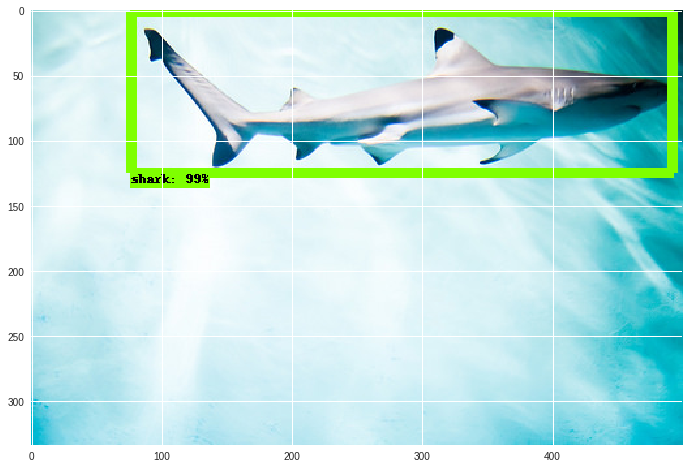
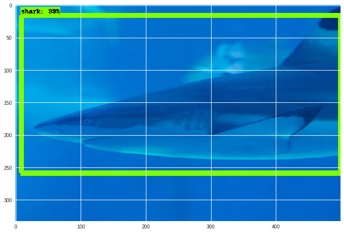
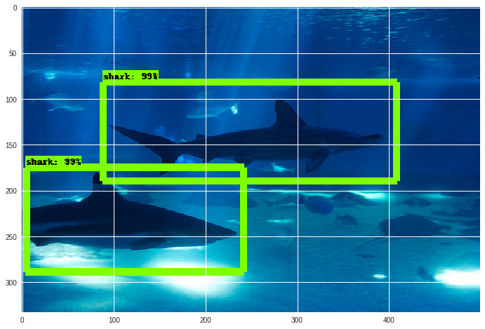

# tf_shark_detector_colab
TensorFlow Object Detection API using Google Colab

## Introduction
Apply [Tensorflow Object Detection API](https://github.com/tensorflow/models/tree/master/research/object_detection) pre-trained model for custom dataset. In this project, we support the [Shark Pulse project](http://baseline3.stanford.edu/SharkPulse/) led by Stanford researchers at Hopkins Marine Station. We labelled (annotated) 200 shark images with [labelImg toolkit](https://github.com/tzutalin/labelImg), by drawing bounding boxes around the sharks. Then trained with TensorFlow Object Detection model to detect sharks in the images. This shark detector serves as image collector for Shark Pulse project that aims to establish shark species baseline for reseearch and conservation purposes.

## Code
See Colab (Jupyter) notebooks for more details. "tf_shark_detector_colab.ipynb" is for training, building inferences, and testing; "prediction_crop" is for making predictions and detect shark in the videos and crop the bounding boxes. The scripts can be used for other custom image datasets. Google Colab provides free GPU resources!

## Pre-trained model
We utilized Faster R-CNN pre-trained on inception_v2 COCO dataset (2018/01/28).

## Requirements
- Python 2
- TensorFlow 1.2
(already installed with Google Colab environment)
- Image datasets and annotation files (upload to Google Drive as .zip files)

## Create dataset
Annotation files (xmls) with [labelImg toolkit](https://github.com/tzutalin/labelImg). The model for this project was trained for "one class" object detection. It is possible to modify the code for multiple classes.

Steps to create dataset
- Collect images of objects (here we collect about 200 shark pictures)
- Rename image filenames with format "shark_1.jpg" (name_number.jpg)
- Create annotation files; LabelImg saves annotations as XML files in PASCAL VOC format.
- Create dataset.zip file (see below for basic file structure; you can also download my dataset.zip to see how it structures)
- Upload dataset.zip to your Google Drive

Zip file structure:

dataset.zip file

- images directory
   - image files (format: shark_1.jpg)
- annotations directory
   - xmls directory
     - annotation files (format: shark_1.xml)
    
## Create label_map.pbtxt
Create label_map.pbtxt:

item {
  id: 1
  name: 'shark'
}

